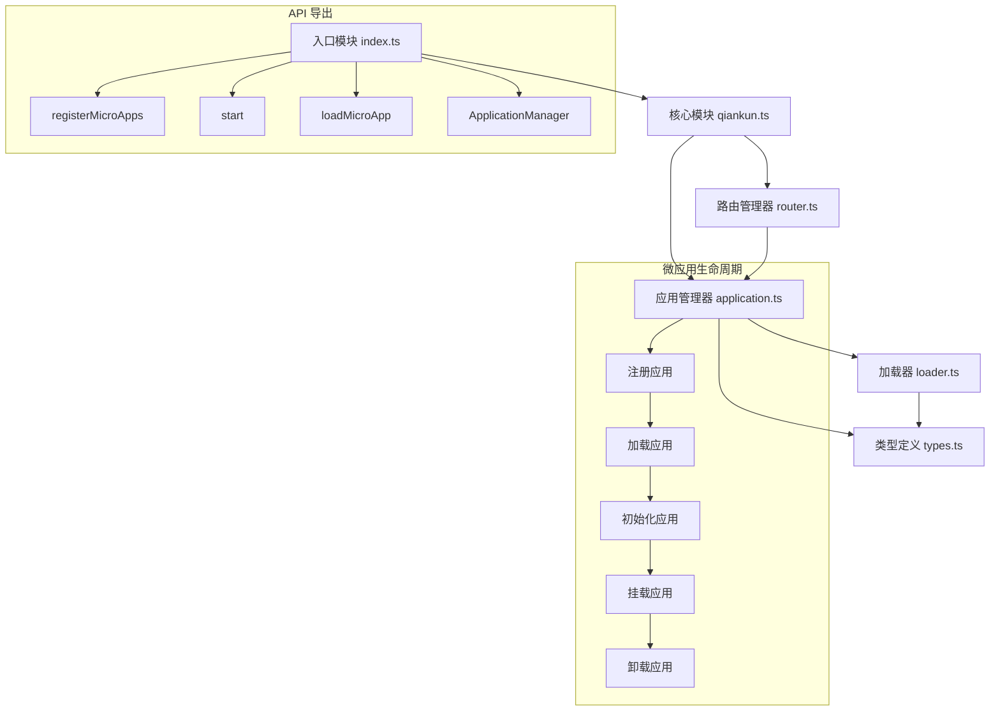

# mini-qiankun

mini-qiankun 是一个轻量级微前端框架，提供了微应用注册、加载、生命周期管理等核心功能，帮助开发者构建模块化、可扩展的前端应用。

## 项目架构

mini-qiankun 的架构主要由以下几个核心模块组成：

1. **核心模块 (qiankun.ts)**
   - 提供 `registerMicroApps` 和 `start` 等核心 API
   - 协调路由管理器和应用管理器的工作

2. **应用管理器 (application.ts)**
   - 管理所有注册的微应用及其生命周期
   - 负责应用的注册、加载、挂载、卸载等操作

3. **加载器 (loader.ts)**
   - 处理微应用资源的加载
   - 提取并执行微应用的脚本和样式

4. **路由管理器 (router.ts)**
   - 监听路由变化
   - 匹配激活对应的微应用

5. **类型定义 (types.ts)**
   - 提供框架所需的类型定义

## 架构图



## 核心功能

### 1. 微应用注册

使用 `registerMicroApps` 函数注册一个或多个微应用：

```typescript
import { registerMicroApps } from 'mini-qiankun';

registerMicroApps([
  {
    name: 'app1',
    entry: '//localhost:8080',
    container: '#container',
    activeRule: '/app1',
  },
  {
    name: 'app2',
    entry: '//localhost:8081',
    container: '#container',
    activeRule: '/app2',
  },
]);
```

### 2. 启动框架

使用 `start` 函数启动微前端框架：

```typescript
import { start } from 'mini-qiankun';

start();
```

### 3. 手动加载微应用

使用 `loadMicroApp` 函数手动加载微应用（不依赖路由）：

```typescript
import { loadMicroApp } from 'mini-qiankun';

loadMicroApp({
  name: 'app3',
  entry: '//localhost:8082',
  container: '#container',
});
```

### 4. 生命周期钩子

注册微应用时可以提供生命周期钩子函数：

```typescript
registerMicroApps([
  {
    name: 'app1',
    entry: '//localhost:8080',
    container: '#container',
    activeRule: '/app1',
    bootstrap: () => console.log('app1 初始化'),
    mount: () => console.log('app1 挂载'),
    unmount: () => console.log('app1 卸载'),
  },
]);
```

## 开发指南

### 安装依赖

```bash
pnpm install
```

### 构建项目

```bash
pnpm run build
```

### 运行示例

请参考各微应用的说明文档。

## 贡献指南

1. Fork 本仓库
2. 创建特性分支
3. 提交代码
4. 提交 Pull Request

## 许可证

MIT